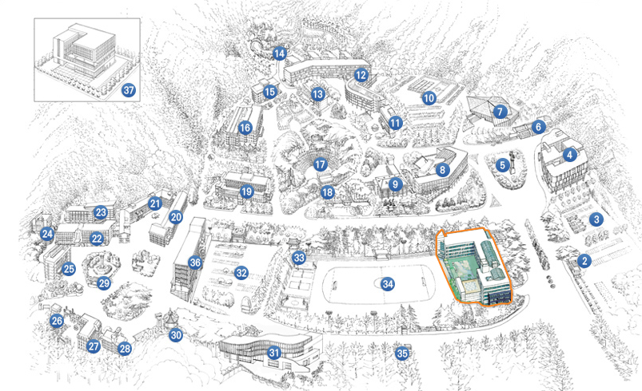

<br>

<!-- <center></center>   -->


<!-- Try changing a few things and reknitting a single page or rebuilding the whole site. Do your own thing, or here are a few things to try:  -->

<br> 

### 찾아오는 길



<!-- You'll need to add it to the nav bar in `_site.yml` too. -->

**연구실 위치**
<br>
 - 대전광역시 서구 배재로 155-40(도마동) 배재21세기관 P342호

**찾아오는 길**
<br>

1) 둔산시외버스터미널 → 둔산 CGV 앞 선사유적지 정류장 301번 버스 (10개 정류장 이동) → 배재대학교 정류장 하차 (약 24분)


2) 둔산고속버스터미널 → 102번 버스 → 216번 버스
```
둥지아파트 정류장까지 도보 약 7분 → 둥지아파트 정류장 102번 버스 승차 (1개 정류장 이동) → 정부청사역 정류장 하차 → 정부청사정류장 216번 버스 승차 (10개 정류장 이동) → 배재대학교 정류장 하차 (약 46분)
```

3) 대전유성터미널 → 유성시외버스 정류장 312번 버스 승차 (15개 정류장 이동) → 배재대학교 정류장 하차 (약 47분)

4) 대전서부터미널 → 도마교 정류장 도보 9분 → 도마교 정류장 312번 버스 승차 (6개 정류장 이동) → 배재대학교 정류장 하차 (약 33분)

5) 대전복합터미널 → 601번 버스 → 612번 버스
``` 
복합터미널 정류장 도보 약 6분 → 복합터미널 정류장 601번 버스 승차 (9개 정류장 이동) → 태평오거리 정류장 하차 → 태평오거리 정류장 612번 버스 승차 (12개 정류장 이동) → 배재대학교 정류장 하차 (약 56분)
```

6) 대전역 → 대전역 정류장 613번 버스 승차 (18개 정류장 이동)
```
변동중학교 정류장 하차 → 배재대학교 도보 약 10분 (약 51분)
```

7) 서대전역 → 버스 이용 (612번 버스)
```
서대전역 정류장 도보 약 4분 → 서대전역 정류장 612번 버스 (18개 정류장 이동) → 경남아파트 정류장 하차 (약 39분)
```
8) 택시 이용 (약 34분) 10,900원


<br>

### 연구실 연락처
```
042-520-5348 
```

<!-- 1. move `./advanced/_footer.html` to `./_footer.html` (or create a new one) -->
<!-- 2. uncomment the footer in `_site.yml` -->

<br>

<!-- ### Add three columns -->

<!-- How would you approach this? See what we did for 3 columns, or Google it. -->

<br> 

<!-- ### What else did you learn?  -->

<!-- [Submit a pull request](https://help.github.com/articles/creating-a-pull-request/) to [this tutorial](https://github.com/jules32/rmarkdown-website-tutorial) and we can update it with what you learn! -->
